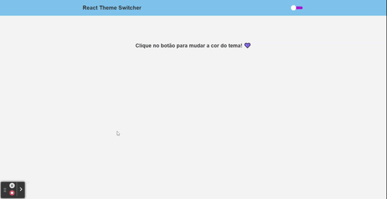
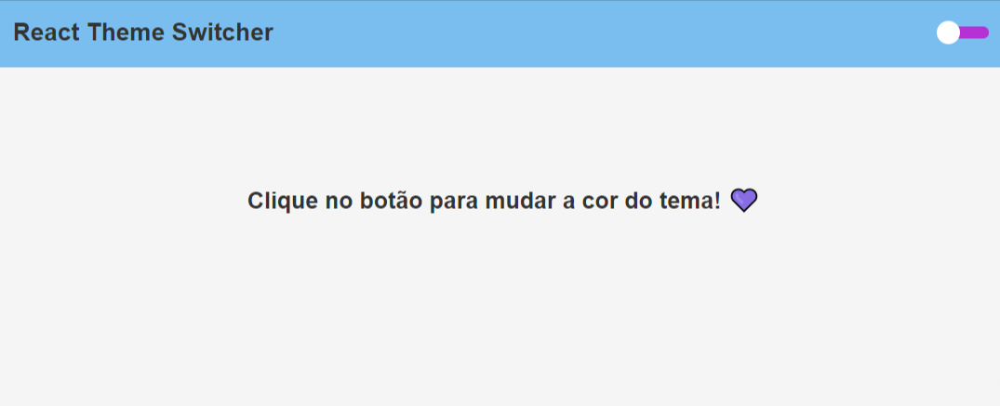

<h1 align="center">
  <strong>💛 React Theme Switcher - Javascript 🖤</strong>
</h1>

<p align="center">
  <a href="#-technologies">Technologies</a>&nbsp;&nbsp;&nbsp;|&nbsp;&nbsp;&nbsp;
  <a href="#-getting-started">Getting started</a>&nbsp;&nbsp;&nbsp;|&nbsp;&nbsp;&nbsp;
  <a href="#-project">Project</a>
<br>

<h1 align="center">
  
</h1>

---

## 🧪 Technologies

This project was developed using the following technologies:

- [React](https://reactjs.org)
- [Polished](https://polished.js.org/)
- [React Switch](https://react-switch.netlify.app/)
- [Styled Components](https://styled-components.com/)

## 🚀 Getting started

Clone the project and access the folder

```bash
$ git clone https://github.com/eltonsantos/themeswitcher-js.git && cd themeswitcher-js
```

Follow the steps below

```bash
# Install the dependencies
$ yarn

# Start the project
$ yarn start

```
just it! 😀

## 💻 Project

<h1 align="center">
  
</h1>

Simple project to change the theme (Dark/Light). It can be used easily in any project. Enjoy! 🥰

---

## 👨🏻‍💻 Author

<h3 align="center">
  
  <br/>
  <strong>Elton Santos</strong> 🚀
  <br/>
  <br/>

 <a href="https://www.linkedin.com/in/eltonmelosantos" alt="LinkedIn" target="blank">
    
  </a>

  <a href="mailto:elton.melo.santos@gmail.com?subject=Olá%20Elton" alt="Email" target="blank">
    
  </a>

<br/>

Made with ❤️ by Elton Santos 👋🏽 [Entre em contato!](https://www.linkedin.com/in/eltonmelosantos/)

</h3>
